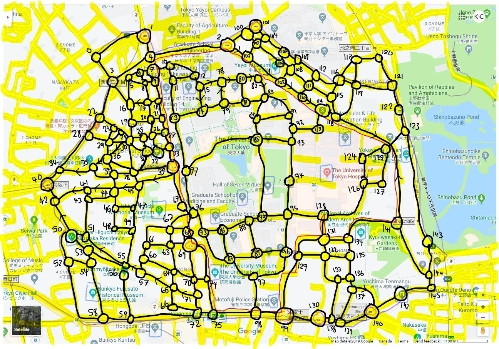

# Dijkstra Transportation Network
Automated Transportation Network using Dijkstra's Algorithm. Represents a district as a graph with nodes, with each intersection being a node. Modifies Dijkstra's algorithm so that it finds the path and individual distances between nodes on the path using identification tokens so that the traversal can be visualized and traversal completion can be implemented into congestion calculation. Attempts to predict traffic light times to optimize time of shortest path. Congestion prevention optimization and calculated trends to be implemented.

